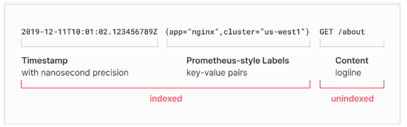

# Prometheus-Grafana-Loki-API-Service
<i>Prometheus-Grafana-Loki-API-Service


# prometheus-export
<i>python-prometheus-export

Prometheus provides client libraries based on Python, Go, Ruby and others that we can use to generate metrics with the necessary labels. 
- Such an exporter can be included directly in the code of your application
- it can be run as a separate service that will poll one of your services and receive data from it, which will then be converted into the Prometheus format and sent to the Prometheus server. 

When Prometheus scrapes your instance's HTTP endpoint, the client library sends the current state of all tracked metrics to the server.

The prometheus_client package supports exposing metrics from software written in Python, so that they can be scraped by a Prometheus service.
Metrics can be exposed through a standalone web server, or through Twisted, WSGI and the node exporter textfile collector.

- API Interface : DB Interface API to get the recors from the DB(https://github.com/euiyounghwang/DB-Interface-Export), ES Configuration API to get the configuration for all env's(https://github.com/euiyounghwang/es-config-interface), Kafka Interface API to get Offsets/ISR information(https://github.com/euiyounghwang/kafka_job_interface_service)


#### Python V3.9 Install
```bash
sudo yum install gcc openssl-devel bzip2-devel libffi-devel zlib-devel git 
wget https://www.python.org/ftp/python/3.9.0/Python-3.9.0.tgz 
tar –zxvf Python-3.9.0.tgz or tar -xvf Python-3.9.0.tgz 
cd Python-3.9.0 
./configure --libdir=/usr/lib64 
sudo make 
sudo make altinstall 

# python3 -m venv .venv --without-pip
sudo yum install python3-pip

sudo ln -s /usr/lib64/python3.9/lib-dynload/ /usr/local/lib/python3.9/lib-dynload

python3 -m venv .venv
source .venv/bin/activate

# pip install -r ./dev-requirement.txt
pip install prometheus-client
pip install requests
pip install JPype1
pip install psycopg2-binary
pip install jaydebeapi
pip install pytz
pip install httpx

# when error occur like this
# ImportError: urllib3 v2 only supports OpenSSL 1.1.1+, currently the 'ssl' module is compiled with 'OpenSSL 1.0.2k-fips  26 Jan 2017'. See: https://github.com/urllib3/urllib3/issues/2168
pip install urllib3==1.26.18
pip install pytz
```


### Using Poetry: Create the virtual environment in the same directory as the project and install the dependencies:
- Gunicorn/FastAPI : https://chaechae.life/blog/fastapi-deployment-gunicorn#google_vignette
```bash
python -m venv .venv
source .venv/bin/activate
pip install poetry

# --
poetry config virtualenvs.in-project true
poetry init
poetry add fastapi
poetry add requests
poetry add pytz
poetry add httpx
poetry add httpx
poetry add uvicorn
poetry add python-dotenv
poetry add python-logging-loki

...

# start with gunicorn config
gunicorn.config.py

import multiprocessing
 
workers = multiprocessing.cpu_count() * 2 + 1
worker_class = "uvicorn.workers.UvicornWorker"
wsgi_app = "app.main:app"
timeout = 60
loglevel = "info"
bind = "0.0.0.0:8000"
max_requests = 1000
max_requests_jitter = 100

...
gunicorn -c app/gunicorn.config.py

gunicorn -k uvicorn.workers.UvicornWorker main:app --bind 0.0.0.0:8010 --workers 4

..
uvicorn app.main:app --reload for dev
```
or you can run this shell script `./create_virtual_env.sh` to make an environment. then go to virtual enviroment using `source .venv/bin/activate`


# Grafana-Loki
- Prometheus, Loki, Promtail, Grafana, Collector as export app (Exports data in the Prometheus format, which allows it to be scraped by a Prometheus server.)
- Promtail(https://github.com/grafana/loki/releases/) is an agent which ships the contents of local logs to a private Grafana Loki. Loki is a horizontally scalable, highly available, multi-tenant log aggregation system inspired by Prometheus and developed by Grafana Labs. Loki(https://github.com/grafana/loki/releases/) aims to simplify effective and user-friendly collection and storage of logs. Loki differs from Prometheus by focusing on logs instead of metrics, and collecting logs via push, instead of pull.
- Flow (./architecure/Data_Flow.PNG)
- https://rulyox.blog/2021-10-24-Prometheus-Loki-Grafana%EB%A5%BC-%EC%9D%B4%EC%9A%A9%ED%95%9C-%EB%AA%A8%EB%8B%88%ED%84%B0%EB%A7%81-%EC%8B%9C%EC%8A%A4%ED%85%9C-%EA%B5%AC%EC%B6%95/
- Installation : https://m.blog.naver.com/setopia1112/223123551825
- Grafana Loki Setup
```bash
wget https://github.com/grafana/loki/releases/download/v2.9.1/loki-linux-amd64.zip
unzip loki-linux-amd64.zip
./loki-linux-amd64 --config.file=./loki-config.yml
nohup ./loki-linux-amd64 -config.file=./loki-config.yaml 2>&1 &

# --
auth_enabled: false

server:
  http_listen_port: 3100
  grpc_listen_port: 9096

common:
  instance_addr: 0.0.0.0
  path_prefix: ./tmp/loki
  storage:
    filesystem:
      chunks_directory: ./tmp/loki/chunks
      rules_directory: ./tmp/loki/rules
  replication_factor: 1
  ring:
    kvstore:
      store: inmemory

query_range:
  results_cache:
    cache:
      embedded_cache:
        enabled: true
        max_size_mb: 100

schema_config:
  configs:
    - from: 2020-10-24
      store: boltdb-shipper
      object_store: filesystem
      schema: v11
      index:
        prefix: index_
        period: 24h

ruler:
  alertmanager_url: http://localhost:9093

limits_config:
    enforce_metric_name: false
    ingestion_burst_size_mb: 20
    ingestion_rate_mb: 200
    ingestion_rate_strategy: global
    max_cache_freshness_per_query: 10m
    max_global_streams_per_user: 10000
    max_query_length: 12000h
    max_query_parallelism: 16
    max_streams_per_user: 0
    max_entries_limit_per_query: 1000000
    reject_old_samples: true
    reject_old_samples_max_age: 168h
# --
```
- Pushing Logs to Loki Without Using Promtail (https://medium.com/geekculture/pushing-logs-to-loki-without-using-promtail-fc31dfdde3c6, https://github.com/sleleko/devops-kb/blob/master/python/push-to-loki.py)
- Pushing Logs to Loki with "python-logging-loki"
- Push logs to Grafana-loki(`https://github.com/euiyounghwang/Prometheus-monitoring-exporter/blob/master/Grafana-log/push_to_loki.sh`) via REST API (https://github.com/euiyounghwang/Prometheus-Grafana-Loki-API-Service)
- Grafana Dashboard : `sum(count_over_time({service=~"prometheus-monitoring-service|prometheus-grafana-loki-logging-service|prometheus-alert-service"}[$__interval]))`, `{service=~"prometheus-grafana-loki-logging-service", env=~"$Kafka_Data_Source_Env"}`
```bash
pip install python-logging-loki

import logging
import logging_loki
logging_loki.emitter.LokiEmitter.level_tag = "level"
# assign to a variable named handler 
handler = logging_loki.LokiHandler(
   url="http://loki:3100/loki/api/v1/push",
   version="1",
)
# create a new logger instance, name it whatever you want
logger = logging.getLogger("my-logger")
logger.addHandler(handler)

# now use the logging object's functions as you normally would
logger.error(
   "Something bad happened",
  
   extra={"tags": {"service": "my-service"}},
)
logger.warning(
   "Something bad happened but we can keep going",
   extra={"tags": {"service": "my-service"}},
)
# extra={"tags": {"service": "my-service", "one": "more thing"}}
```

- Grafana Promtail Setup
```bash
wget https://github.com/grafana/loki/releases/download/v2.8.0/promtail-linux-amd64.zip
unzip promtail-linux-amd64.zip
nohup ./promtail-linux-amd64 -config.file=promtail-config.yaml 2>&1 &
- How to use : https://kbcoding.tistory.com/122
# --
server:
  http_listen_port: 9080
  grpc_listen_port: 0

positions:
  filename: /tmp/positions.yaml

clients:
  - url: http://loki:3100/loki/api/v1/push

scrape_configs:
- job_name: logging
  static_configs:
  - targets:
      - localhost
    labels:
      job: logging
      __path__: /logs/*.log
# --
```
- Promtail Format



### Register Service
- sudo service grafana_loki_interface_api status/stop/start/restart
```bash
#-- /etc/systemd/system/grafana_loki_interface_api.service
[Unit]
Description=Grafana Loki Interface API

[Service]
User=devuser
Group=devuser
Type=simple
ExecStart=/bin/bash /home/devuser/rest_api/grafana_loki_interface_api/service-start.sh
ExecStop= /usr/bin/killall /grafana_loki_interface_api

[Install]
WantedBy=default.target


# Service command
sudo systemctl daemon-reload 
sudo systemctl enable grafana_loki_interface_api.service
sudo systemctl start grafana_loki_interface_api.service 
sudo systemctl status grafana_loki_interface_api.service 
sudo systemctl stop grafana_loki_interface_api.service 

sudo service grafana_loki_interface_api status/stop/start
```


### Grafana Dashboard
- Grafana-Loki Dashboard: https://github.com/euiyounghwang/Prometheus-monitoring-exporter/blob/master/Grafana_Dashboard/loki-log-dashboard.json
- Kafka/Zookeeper Service : {job=~"zookeeper_logs", env=~"$Kafka_Data_Source_Env"}
